# Virtualization Introduction - only x86

[TOC]

首先我们来看没有虚拟化，操作系统是如何运行的

操作系统上的程序分为两种，一种是**用户态**的程序，例如 Word、Excel 等，一种是**内核态**的程序，例如内核代码、驱动程序等。


为了区分内核态和用户态，CPU 专门设置四个特权等级 0、1、2、3 来做这个事情。@季文康

|  |  |
| ------------------------------------------------------------ | ---------------------------------------------------- |

> 关于 **Ring** 环的介绍（早期版本的硬件只支持2个保护等级）：
>
> Level 0
>
> - The inner most layer of the rings
> - Contains
>   - Security kernel
>   - Memory-resident components
>
> Level 1
>
> - Less important code or processes than level 0
>   - "As-needed"OS components other than Kernel
>   - Loaded into the memory when necessary
>
> Level 2
>
> - System utilities
> - l/O drivers
> - Protocols
>
> Level 3:User Mode
>
> - User application processes

大牛们在写 Linux 内核的时候，如果用户态程序做事情，就将扳手掰到第 3 等级，一旦要申请使用更多的资源，就需要申请将扳手掰到第 0 等级，内核才能在高权限访问这些资源，申请完资源，返回到用户态，扳手再掰回去。通常只使用这两个环：用于内核模式的ring 0 和用于用户模式的 ring 3.

> 应用程序是运行在 Ring3上的，如果应用程序需要访问磁盘，比如写文件，那就需要通过执行系统调用（函数），执行系统调用的时候，CPU 运行级别将从 Ring 3 切换到 Ring 0，并跳转到系统调用对应的内核代码位置执行，这样内核就为你完成了设备的访问，完成之后再从 Ring0 切换到 Ring3，**这个过程称之为 用户态 和 内核态 的切换。**

这个程序一直非常顺利地运行着，直到虚拟机出现了。

# Why


通过虚拟化，可以将单台计算机划分成多台虚拟机，每台虚拟机拥有自己的操作系统。从物理机角度上看，它们彼此是独立的。具体来说就是具有自己的网络接口和IP地址、文件系统以及其他外围设备。（特指完全虚拟化环境下）从每个操作系统的角度来看，他们运行在自己的专有硬件（虚拟出来的硬件）上。它们认为自己是和硬件直接在打交道，但其实是同 `qemu` 模拟出来的硬件打交道，并且 `qemu` 会将这些指令 **转译（中间人）**给真正的硬件。

------------------

## Hypervisor 基础

> 关于 Hypervisor 的介绍：
>
> 每一个操作系统都有一个内核 kernel ，而这个 kernel 是需要对 CPU 的 ring0 进行操作的。如果没有任何限制，运行多台虚拟机则会出现多个操作系统**同时**抢占 CPU。所以运行多台虚拟机就需要一个调度程序去进行调度，它被称为 hypervisor （**虚拟机控制软件**）。通过这样处理以后，我们就得到了虚拟机，而虚机运行在 ring3 环。反过来说。在 ring3 称为用户模式下的 **全虚拟化** 虚拟机。
>
> 目前市场主要厂商及产品：VMware vSphere、微软Hyper-V、Citrix XenServer 、IBM PowerVM、Red Hat Enterprise Virtulization、Huawei FusionSphere、开源的KVM、Xen、VirtualBSD等。

`hypervisor` 是管理和支持虚拟化环境的软件，可为每个操作系统运行虚拟机，并且为每个虚拟机提供虚拟 CPU、内存、磁盘、网络和其他外围设备的访问权限。同时限制虚拟机，使其无法直接访问实际硬件以及互相直接访问。

提供 `hypervisor` 的物理计算机或操作系统称为 `host` 计算节点。客户机 `guest` 是在 `hypervisor` 上运行的虚拟机。

## Hypervisor 类型

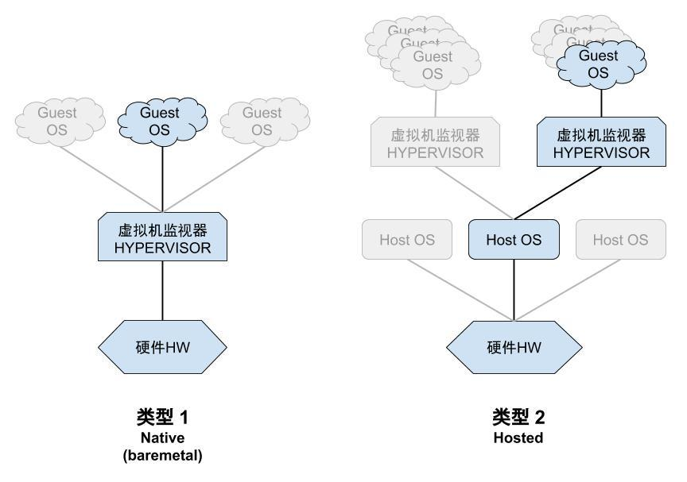

一般来说我们分为俩类，一种是 `Bare Metal`，直接在硬件上来控制硬件和管理虚拟机的操作系统 ；另外一种是安装在 `hosted OS` 上的 `hypervisor`，运行在传统的操作系统上，就像其他计算机程序那样运行。他们都有其代表产品。@季文康

| Type 1 (Bare Metal) Hypervisors                    | Type 2 (Hosted) Hypervisors                                |
| -------------------------------------------------- | ---------------------------------------------------------- |
| Xen， Oracle VM Server， Hyper-V， ESXi， IBM z/VM | VMware Workstation， VirtualBox， Parallels Desktop， QEMU |

> **KVM is a virtualization module in Linux kernel that works  similar to a hypervisor, while Xen is a type 1 hypervisor that allows  multiple operating systems to execute on the same computer hardware,  simultaneously.**

传统的 Type 1 是优于 Type 2 性能的。但随着虚拟化技术的发展，在有些产品上这个界限并不十分清晰。Linux 系统上的 KVM(Kernel-based Virtual Machine)和 FreeBSD 系统上的 bhyve 都是**内核模块**，它们可以很高效地将主机操作系统转化为 Type-1 类型的虚拟机监视器。同时，因为 Linux 发行版和 FreeBSD 都是非常通用的操作系统，且运行其上的**其他应用程序会跟虚拟机抢占资源**，因此 KVM 和 bhyve 也可以归类为 Type-2 类型的虚拟机监视器。@季文康

# What

虚拟化主要分为三种类型：**完全**虚拟化、**半**虚拟化和**软件**虚拟化。**同时这三种分类也是不同厂商的产品，他们的区别所在。**

简单理解：完全虚拟化，就是对虚拟机不做任何修改即可运行。如果我的 CPU 具有 vmx|svm 的 flag 标志，则允许开启硬件辅助支持而具有更好的效能；如果我的 CPU 没有这个标志，我可以使用软件仿真做二进制转换来启动虚拟机。但这种方式速度极慢，并且 Host 是 32位系统，则 Guest 也只能是 32位系统等等限制。如果你嫌弃这样太慢，可以将虚拟机的 kernel 部分做一定修改（这一要求也使得无法运行 Windows 这种闭源操作系统），使得虚拟机知道自己是虚拟机从而更好的被 Host 运行，这就是半虚拟化。现在很少有人会在生产环境中使用半虚拟化了，但这并不代表完全虚拟化就和半虚拟化处在对立面。比如说我们可以在 VMware 中安装 vmware tools 以实现更好的性能，而这个 vmware tools 就是一个半虚拟化的东西。

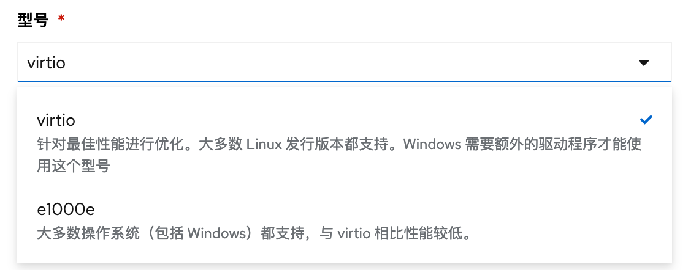

--------

## 虚拟化分类

| 类型                                                      | 别名                              | Ring | 性能 | 支持 | 原因                                             |
| --------------------------------------------------------- | --------------------------------- | ---- | ---- | ---- | ------------------------------------------------ |
| 硬件仿真(Hardware Emulation)                              | 软件虚拟化                        | 3    | 🌟    | ❌    | 不支持 32位的 Host 安装 64 位的 Guest            |
| 完全虚拟化(Full Virtualization)                           | 全虚拟化                          |      |      | ⭕️    | 全平台支持。                                     |
| 硬件辅助完全虚拟化(Hardware-assisted Full Virtualization) | 原生虚拟化(native virtualization) | -1   | 🌟🌟🌟  | ⭕️    | 全平台支持，是目前通用方案。                     |
| 半虚拟化(Paravirtualization)                              | 超虚拟化                          |      | 🌟🌟🌟🌟 | ❌    | 由于需要修改操作系统，因此对闭源系统相当不友好。 |

### 硬件仿真 VS 半虚拟化

| 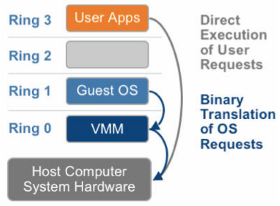 | 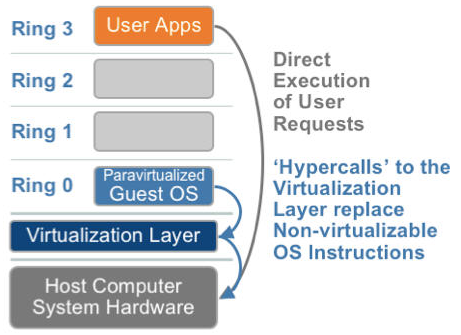 |
| ------------------------------------------------------- | ------------------------------------------------------- |

## 虚拟化详细

| 虚拟化类型                                               | 介绍                                                         |                                                              | Hypervisor                                                   | 其他                                                         |                                                              |
| -------------------------------------------------------- | ------------------------------------------------------------ | ------------------------------------------------------------ | ------------------------------------------------------------ | ------------------------------------------------------------ | ------------------------------------------------------------ |
| 硬件仿真（Hardware Emulation）                           | 硬件仿真虚拟化使用较慢的二进制转换和其他仿真技术来运行未经修改的操作系统。 |                                                              | 一切就像没有 hypervisior 在运行一样，软件虚拟化主要问题在于如何拦截虚拟机内核所做的事情。 | Oracle VM VirtualBox 用到了 Qemu 进行软件仿真。              |                                                              |
| 完全虚拟化(Full Virtualization)                          | 通过 hypervisior 在客户操作系统与底层硬件之间进行必要的“协调”。 | 配备虚拟外围设备后，虚拟机环境看起来就像是裸机一样。         | 物理硬件的访问权限由 hypervisor 控制，因此虚拟机之间不会互相干扰。 |                                                              | 它的效率远远高于硬件仿真，并且无需修改客户操作系统。但由于特权指令需要经过VMM的处理，因此其性能仍然远低于物理硬件本身。 |
| 硬件辅助完全虚拟化(hardware-assisted fullvirtualization) | 硬件辅助完全虚拟化使用系统 CPU 的硬件特性，为虚拟客户提供底层物理系统的完全抽象。 |                                                              | hypervisior 只需在代码在使用**干涉系统管理程序的状态**或其**支持环境的敏感指令**时介入。 |                                                              | Intel和AMD的CPU都提供了能使 hypervisor 存取Ring 0硬件的 x86虚拟化 指令集。x86虚拟化创建了一个叫Ring -1的Ring，所以虚拟机操作系统可以直接运行在Ring 0上**而不影响其他虚拟机或者宿主系统** |
| 半虚拟化(Paravirtualization)                             | 通过将虚拟化相关代码集成到客户操作系统中，完成对内核的修改。 | 允许hypervisor为客户机操作系统提供特殊接口，以便其更有效地与hypervisor进行通信。通常，这需要对客户机操作系统或特殊 hypervisor 感知型驱动程序的安装进行**修改**。 | 经过修改的系统可以与虚拟化平台紧密协作，因此VMM无需处理特权指令，执行效率与物理硬件相近。 | Xen是一个第一类管理程序，提供的服务允许多个计算机操作系统在同一计算机硬件上同时执行。 | 半虚拟化包含整个内核，就像 Xen 准虚拟机，或者虚拟化 I/O 设备的驱动程序一样。但由于需要修改操作系统，因此对闭源系统相当不友好。 |

## 虚拟化实现原理

[pass, details in slides](https://docs.google.com/presentation/d/1aqBbd_Qk5Yj7VzKeQ7xJlYwLSPHU9wc--93mXs28RpM/edit#slide=id.g4f15f900b1_0_305)

- “特权解除”（De-privileging），简单说就是直接由 VMM 模拟 VM 的**特权指令**，模拟出效果从而将特权指令的特权解除。
- “陷入模拟”（Trap-And-Emulate），对 VM 发起的**非特权的敏感指令**，VMM 采用扫描、翻译，再模拟的方式。@季文康
  - VMware 提前发现，插入断点并截断，再交给 VMM 来解释执行。
  - XEN 直接修改 VM 的敏感指令，修改为主动通知 VMM 来处理。

### VirtualBox 的实现

在没有硬件虚拟化支持的x86 CPU上实现虚拟化是一项异常复杂的任务，因为CPU架构不是为虚拟化而设计的。这些问题通常可以得到解决，但要以降低性能为代价。因此，在虚拟化性能和准确性之间存在着持续的冲突。

- 一切就像没有 hypervisior 在运行一样，软件虚拟化主要问题在于如何**拦截虚拟机内核所做的事情**。
- 对于 VB 来说，完整的软件仿真，通常涉及重新编译。也就是说，所有要由来宾运行的代码都经过分析，转换为不允许 guest 修改或查看 CPU 真实状态的形式，然后才执行。就性能而言，这个过程显然非常复杂且成本高昂。

### XEN 的实现

GuestOS 的内核进行修改过，明确知道自己运行在虚拟化环境中，在进行系统调用时，直接通过 Host 的内核对CPU 进行调用，因为中间少了虚拟化捕获异常，翻译的过程，性能会大大的提升。代表之一：XEN

> **半虚拟化的思想就是，修改操作系统内核，替换掉不能虚拟化的指令**，通过超级调用（hypercall）直接和底层的虚拟化层hypervisor来通讯，hypervisor同时也提供了超级调用接口来满足其他关键内核操作，比如内存管理、中断和时间保持。
>
> 这种做法省去了全虚拟化中的捕获和模拟，大大提高了效率。所以像XEN这种半虚拟化技术，客户机操作系统都是有一个专门的定制内核版本，和x86、mips、arm这些内核版本等价。这样以来，就不会有捕获异常、翻译、模拟的过程了，性能损耗非常低。这就是XEN这种半虚拟化架构的优势。这也是为什么XEN只支持虚拟化Linux，无法虚拟化windows原因，微软不改代码啊。

- **Domain0**: 这是Xen在初期引入的一个特权Dom，Xen  Hypervisor在收到IO请求后，需要先把请求投递到Domain0，完成调度处理后，通过grant copy或者grant  map转发到对应的虚拟机，相比KVM, 整个IO处理路径几乎被拉长了一倍。其次,  x86_64的ring模型相比早期的x86_32也发生了较大变换，从而导致ring压缩，进一步恶化了中断处理的性能。
- **必须重复造轮子：**  最新10年来，CPU已经从单核逐步走向了双核，四核，甚至是几十核心，NUMA技术，TB级内存也基本成为现代服务器的标配，众多厂商和Linux社区在内存和CPU调度和管理上做了大量的工作，而Xen Hypervisor采用独立的CPU和内存调度管理，核心实现还停留在Linux  2.4时代，经过了10年的发展后，根本无力去同步这么多的更新，我们今天会发现，Xen已经落后的太多了，比如：
  1. hugepage：Xen只能提供2M物理页面，而DPDK需要1G的连续物理内存，这是DPDK不能支持Xen的最主要原因。
  2. KSM：透明页面共享。
  3. 多核(>128 CPU)调度: 虽然宣称能支持最大192+ core, 但是实际我们发现如果在128  core的4P服务器上创建大规格虚拟机并在其中使用高精度时钟，导致虚拟机频繁陷入陷出调度cpu，Xen就会出现严重问题，这显然是Xen没有经过大规模商业实践的表现。


------------

## 硬件辅助虚拟化技术（HVM）

**原生虚拟化，性能更好**。允许几乎所有的代码都可未经更改地由 CPU 直接运行，从而提高效率。

也是工程师不断的在改进的地方，要更好的支持**原生虚拟化**。让虚拟化的速度和物理机一样，无论是 CPU 还是 IO or RAM。@季文康

为了**让虚拟机达到原生虚拟化**的目的，需要使用硬件辅助虚拟化技术（HVM）。

### 硬件辅助的CPU技术（VT-x / AMD-V）

|  |  |
| ---------------------------------------------------- | ------------------------------------------------------------ |

2005年后，CPU 厂商 Intel 和 AMD 开始支持虚拟化了。 Intel 引入了 Intel-VT （Virtualization Technology）技术。 这种 CPU，有 **VMX root operation 和 VMX non-root operation两种模式**，两种模式都支持Ring 0 ~ Ring 3 共 4 个运行级别。这样，VMM 可以运行在 VMX root operation模式下，客户 OS 运行在VMX non-root operation模式下。

> 在第一代技术中，支持 `Intel VT/AMD-V` 的 CPU 上提供新处理器指令，可将 CPU 置入新的执行模式。为硬件辅助虚拟机执行指令时， CPU将切换到非 root 或客户机模式，在该模式下虚拟机的内核能够以级别0运行，而用户空间能够以级别3运行。
>
> 对于虚拟机内核来讲，只要将标志位设为虚拟机状态，我们就可以直接在 CPU 上执行大部分的指令，得益于硬件辅助技术，VMM不再需要对指令进行复杂的模拟。不需要虚拟化软件在中间转述，除非遇到特别敏感的指令，才需要将标志位设为物理机内核态运行，这样大大提高了效率。

#### Guest OS 是如何运行的

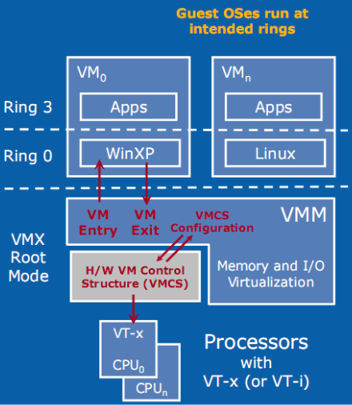


##### vm entry / vm exit

对 KVM 虚机来说，运行在 VMX Root Mode 下的 VMM 在需要执行 Guest OS 指令时执行 VMLAUNCH 指令将 CPU 转换到 VMX non-root mode，开始执行客户机代码，即 VM entry 过程；在 Guest OS 需要退出该 mode 时，CPU 自动切换到 VMX Root mode，即 VM exit 过程。

> 这两种操作模式可以相互转换。运行在 VMX root operation 模式下的 VMM 通过显式调用 VMLAUNCH 或 VMRESUME 指令切换到 VMX non-root operation 模式，硬件自动加载 Guest OS 的上下文，于是 Guest OS 获得运行，这种转换称为 VM entry。Guest OS 运行过程中遇到需要 VMM 处理的事件，例如外部中断或缺页异常，或者主动调用 VMCALL 指令调用 VMM 的服务的时候（与系统调用类似），硬件自动挂起 Guest OS，切换到 VMX root operation 模式，恢复 VMM 的运行，这种转换称为 VM exit。VMX root operation 模式下软件的行为与在没有 VT-x 技术的处理器上的行为基本一致；而VMX non-root operation 模式则有很大不同，最主要的区别是此时运行某些指令或遇到某些事件时，发生 VM exit。

##### VMCS（virtual machine control structure）

**一个普通的 Linux 内核有两种执行模式：内核模式（Kernel）和用户模式 （User）。为了支持带有虚拟化功能的 CPU，KVM 向 Linux 内核增加了第三种模式即客户机模式（Guest），该模式对应于 CPU 的 VMX non-root mode。**

- Guest 模式：执行客户机系统非 I/O 代码，并在需要的时候驱动 CPU 退出该模式；
- Kernel 模式：负责将 CPU 切换到 Guest mode 执行 Guest OS 代码，并在 CPU 退出 Guest mode 时回到 Kernel 模式
- User 模式：代表客户机系统执行 I/O 操作

User mode 中的 QEMU-KVM 会通过 ICOTL 命令来运行虚拟机。KVM 内核模块收到该请求后，它先做一些准备工作，比如将 vcpu 上下文加载到 VMCS（virtual machine control structure）等，然后驱动 CPU 进入 VMX non-root 模式，开始执行客户机代码。


**这样操作以后，就出现了 CPU 快而 RAM 慢的情况。**

### 硬件辅助的内存技术（EPT / NPT）

第二代x86 硬件虚拟化支持内存管理单元(MMU)虚拟化。通常，CPU需要花费很多周期来处理内存页面与虚拟机的映射。MMU 虚拟化允许将工作负载转移到特殊硬件，从而提高性能。Intel将此技术称为扩展页表(ERT)，在Nehalem微型架构处理器中引入。AMD将此技术称为快速虚拟化索引(RVi)， 于2007年在四核Opteron处理器中引入。

**这样 CPU 和 RAM 就都解决掉了。**@季文康

### 硬件辅助的I/O技术（VT-d / IOMMU）

第三代x86 硬件虚拟化支持集中于 I/O 虚拟化。主板芯片集上的使能技术为安全PCI穿透，允许将物理PCI设备直接连接到虚拟机。该技术可为虚拟机提供近似原生的I/O性能。在Intel中，这称为直接 I/O虚拟化技术 (VT-d)；在AMD中，称为 I/0虚拟化技术 (AMD- Vi)(最初称为IOMMU)

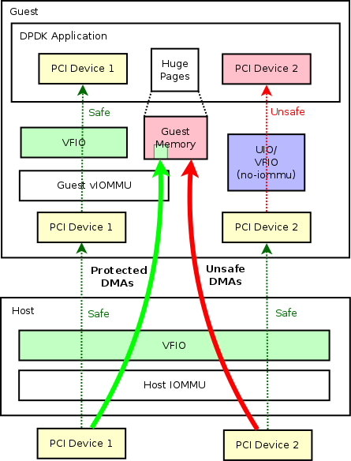

Abort NIC：之前，网卡 nic 还是要通过 hypervsor 交给虚拟机来用 ，造成到了千兆后速度上不去。现在，通过新技术 **SR-IOV** ，将网卡划 48 个口，跨过 hypervisor 直接给 vm 调用。通过多通道的处理，让流量直接交给网卡自己来做。

> 可以使用 SR-IOV 规范在虚拟环境中共享单个物理[PCI Express总线。](https://en.wikipedia.org/wiki/PCI_Express)[[1\] ](https://en.wikipedia.org/wiki/Single-root_input/output_virtualization#cite_note-1)[[2\]](https://en.wikipedia.org/wiki/Single-root_input/output_virtualization#cite_note-2) SR-IOV 为物理服务器机器上的不同虚拟组件（例如[网络适配器）提供不同的](https://en.wikipedia.org/wiki/Network_adapter)[虚拟功能。](https://en.wikipedia.org/wiki/Network_function_virtualization)SR-IOV 使用物理和虚拟功能来控制或配置 PCIe 设备。物理功能能够将数据移入和移出设备，而虚拟功能是轻量级的 PCIe 功能，支持数据流动，但也具有一组受限的配置资源。[虚拟机管理程序](https://en.wikipedia.org/wiki/Hypervisor)或客户操作系统可用的虚拟或物理功能取决于 PCIe 设备。[[3\]](https://en.wikipedia.org/wiki/Single-root_input/output_virtualization#cite_note-3)
>
> SR-IOV 允许虚拟环境中的不同[虚拟机](https://en.wikipedia.org/wiki/Virtual_machines)(VM) 共享单个[PCI Express](https://en.wikipedia.org/wiki/PCI_Express)硬件接口。相比之下，MR-IOV 允许 I/O PCI Express 在不同物理机上的不同 VM 之间共享资源。

**通过这种技术，就解决了 IO 性能问题**。

补充说明，以下来自红帽虚拟化团队 YangHang Liu 工程师：

```mermaid
graph LR
    VM --> |"uses"| VirtualNic[Virtual NIC]
    VirtualNic --> |"part of"| VirtLayer[Virt Layer]
    VirtLayer --> |"connects to"| KernelBridge[Kernel Bridge]
    KernelBridge --> |"interfaces with"| PhysicalNic[Physical NIC]
```

概念层面：全虚拟化网卡的设计意味着数据传输过程中会经历上述五个步骤。而virtio网卡对全虚拟化网卡进行了改进，使其在数据传输时无需经过类似于“virt layer”这一层，从而提高了效率。

代码层面：在虚拟网卡的数据传输过程中，经过的协议栈越少，其资源消耗就越低，性能也相应更优。

从虚拟机到宿主机的数据路径，网络优化方案包括：

- virtio 模型类型
- vhost 驱动
- macvtap 接口
- vfio-vf（SR-IOV）/ vfio-pf

# How

首先简单说下思路，首先我会介绍 qemu 是一个二进制转换的**模拟器**，而 kvm 是一个**内核模块**。但这俩相结合就是具有 HVM 能力的 **hypervisor** （单独的 kvm 并不具备虚拟机的功能，需要跟 qemu 进行结合）。然后我会介绍一下 libvirt 并使用 libvirt 搭建一个虚拟机，我们会指出它们三者之间的**调用关系**。

在本文的范围内，我们的目标是 KVM 虚拟化技术。因此，最好是用 QEMU/KVM hypervisor 而不是 其他hypervisor 的场景来考虑与libvirtd 的通信。你可能会对使用 QEMU/KVM 而不是 QEMU 或 KVM 作为底层 hypervisor 的名称有些困惑。但别担心，一切都会在适当的时候变得明了。下面会讨论 QEMU 和 KVM 之间的联系。目前你只需了解该 hypervisor 同时用到了QEMU 和 KVM 技术。

## Q & A

开始之前，让我们尝试提出一些问题并试图回答看看：

Q1：KVM 和 QEMU 有什么区别？

A1：QEMU 使用仿真；KVM 使用处理器扩展 (HVM) 进行虚拟化。

Q2：QEMU 和 KVM 是独立的吗？

A2：是，但不完全是。KVM 模块的职责就是打开并初始化 VMX 功能，提供相应的接口以支持虚拟机的运行。 QEMU（quick emulator) 本身并不包含或依赖 KVM 模块，而 是一套由 Fabrice Bellard 编写的模拟计算机的自由软件。 QEMU 模拟器是一个纯软件的实现，可以在没有 KVM 模块的情况下独立运行，但是性能比较低。

Q3：那为何还会有 qemu-kvm 这个名词？

A3：单纯的使用 Qemu 属于完全虚拟化，性能特别低。所以 Qemu 将 KVM 整合进来，将有关 CPU 指令的部分交由内核模块来做，就是 qemu-kvm (qemu-system-XXX)。另外 Qemu 还会模拟其他的硬件，如网络和硬盘。同样，全虚拟化的方式也会影响这些设备的性能。这个时候就需要让 GuestOS 知道自己是虚拟机，需要加载特殊的半虚拟化驱动来提高性能。总之 qemu-kvm 就是这样的一种技术。它补充了 kvm 技术的不足，而且在性能上对 kvm 进行了优化。

Q4：QEMU-KVM 相比原生 QEMU 的改动？

A：原生的 QEMU 通过指令翻译实现 CPU 的完全虚拟化，但是修改后的 QEMU-KVM 会调用 ICOTL 命令来调用 KVM 模块；原生的 QEMU 是单线程实现，QEMU-KVM 是多线程实现。

Q5：QEMU 和 KVM 与 Libvirt 有什么联系？

A：KVM 只是内核模块，用户并没法直接跟内核模块交互，需要借助用户空间的管理工具，而这个工具就是 Libvirt。而 KVM 和 QEMU 相辅相成，QEMU 通过 KVM 达到了硬件虚拟化的速度，而 KVM 则通过 QEMU 来模拟设备。简单直接的理解就是：QEMU 是个计算机模拟器，而 KVM 为计算机的模拟提供加速功能，Libvirt 是一个位于最终用户和 qemu-kvm 之间的中间层。

------------------------------------

还是很困惑的话，这非常正常。让我们开始吧！

## QEMU

- QEMU 实际上是一个执行硬件虚拟化的 Hypervisor/VMM。QEMU 既可以充当模拟器（Emulator）也可以用作虚拟机（Virtualizer），所以说它是一个通用的开源机器模拟器和虚拟器。
  - **Qemu as an Emulator：**当QEMU作为一个仿真器运行时，它能够在一种机器架构（x86）运行另外的架构（ARM）中的 OS/APP。它使用到了二进制转译的方法。在这种模式下，QEMU 通过将 Guest 的代码运行在 Host CPU 上来进行动态的二进制转译，实现 CPU  模拟。具体是通过二进制转译程序 Tiny Code Generator（TCG）来完成这项工作的，它是一个即时编译器。
  - **QEMU as virtualizer：**这种模式 QEMU 直接在主机 CPU 上执行 Guest 的代码，从而达到了原生性能。例如，当在 Xen/KVM hypervisor 下工作时，QEMU 可以在这种模式下运行。如果 KVM 是底层 hypervisor，那么 QEMU 可以对嵌入式客户机进行虚拟化，如 Power PC、S390、x86 等。@季文康

### QEMU 模拟器

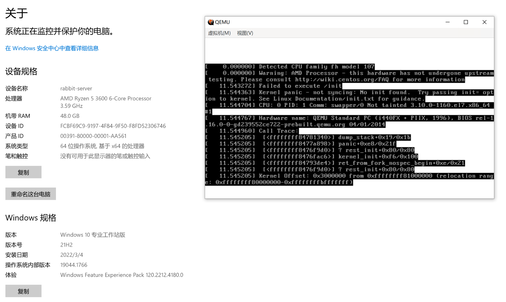

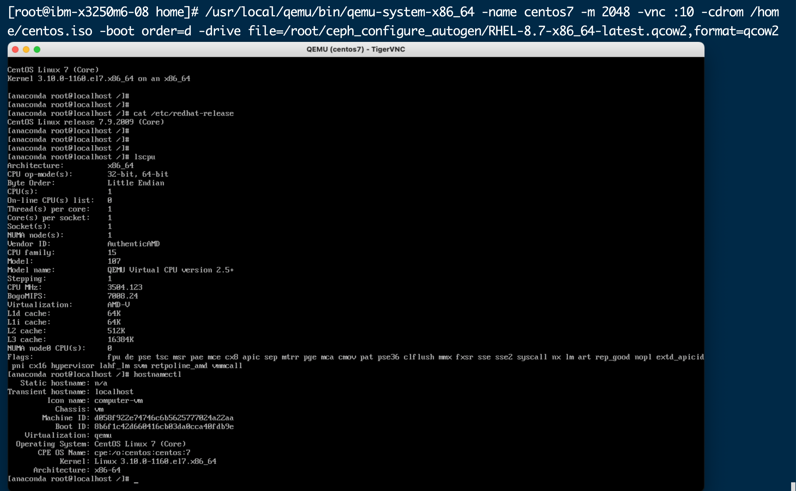

- QEMU 有整套的虚拟机实现，由以下部分构成
  - 处理器模拟器（x86、IBM Z、PowerPC、Sparc）

  - 模拟的设备（显卡、网卡、硬盘、鼠标）
  - 用于将被模拟设备连接到相关主机设备的通用设备
  - 被模拟计算机（PC、Power Mac）的说明
  - 调试程序
  - 用来与模拟器交互的用户界面

### QEMU 虚拟器


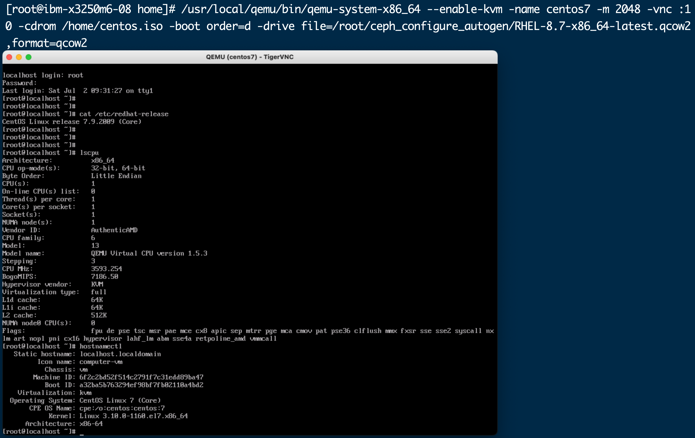

- QEMU 是一个**用户空间**的进程，需要通过**特定的接口**才能调用到 KVM 模块提供的功能。
- 从 QEMU 角度来看，虚拟机运行期间，QEMU 通过 KVM 模块提供的系统调用接口进行内核设置，由 KVM 模块负责将虚拟机置于处理器的特殊模式运行。**QEMU 使用了 KVM 模块的虚拟化功能，为自己的虚拟机提供硬件虚拟化加速以提高虚拟机的性能。**
- **当用作虚拟器时，QEMU 通过直接在主机 CPU 上执行来宾代码来实现接近原生的性能。**在 Xen 管理程序下执行或在 Linux 中使用 KVM 内核模块时，QEMU 支持虚拟化。使用 KVM 时，QEMU 可以虚拟化 x86、服务器和嵌入式 PowerPC、64 位 POWER、S390、32 位和 64 位 ARM 以及 MIPS 客户机。

### 更多内容

> QEMU 包括一个通用的系统调用转换器，也可以重定向主机和程序之间的 POSIX 信号。QEMU 使用基于 JSON 的 QMP 协议控制虚拟机，利用 virtio 技术，实现了 IO 虚拟化。在虚拟机和主机之间使用 vmchannel 技术实现简单通信，比如说共享剪贴板。内存方面：利用 KSM 内存页合并技术降低内存消耗。利用 virtio-pmen 直接调用主机页面缓存；将决策交给主机本身，并降低虚机内存。还可以利用 /dev/shm/ivshmem 在虚拟机之间内存后端。网络方面：利用 virtio-net-failover 技术，实现一个 pci 设备和一个 net 设备之间数据路径的接管。使用 VhostNet 技术，实现了比 e1000 提供了更好的延迟和比 virtio 更快的吞吐量(7~8Gib/sec)。同时支持磁盘仿真，输出文件包括了 qcow2、raw 等格式，也包括了 vmdk、vdi，甚至是一些少见的格式比如说 dmg、cloop、luks，另外包括一些 iscsi、光盘、软盘、USB、PXE boot 能力。测试方面：虚拟机支持热拔插，包括了 CPU、PCI 设备. 虚拟机迁移能力、虚拟机嵌套能力等。此外，时间问题可以在 guest 内查到 kvm-clock 输出。

### 总结时刻

简而言之，QEMU 可以在没有 KVM 的情况下，以前文提到的二进制转译的方式运行。与启用 KVM 的硬件辅助虚拟化相比，这种方式的执行速度会慢一些。**无论在哪种模式下，QEMU 不仅模拟处理器，还模拟了不同的外围设备，如磁盘、网络、VGA、PCI、串口和并行端口、USB 等。**除了 I/O 设备的模拟，在使用 KVM 时，QEMU-KVM 创建并初始化虚拟机。它还为每个 vCPU 初始化不同的 posix 线程。此外，它还提供了一个框架，在 QEMU-KVM 用户模式地址空间中，模拟虚拟机的物理地址空间。

## KVM

对于 **KVM**（英文 Kernel-based Virtual Machine 的缩写） 来说，其是一款支持虚拟机技术，而且是 linux 内核中的一个**功能模块**。它在 linux2.6.20 之后的任何 linux 分支中都被支持。@季文康

**当您安装了 KVM 内核模块，KVM 轻松的将 Linux 内核转换为一个 hypervisor。**尽管如此，由于 hypervisor 是**一个标准的 Linux 内核，使得它可以从标准内核的更新中受益（内存支持，调度等）**。对这些 Linux 组件的优化，不仅让 hypervisor 从中受益，也有利于 Linux Guest OS。在I/O仿真方面，KVM 使用了一个用户态软件 QEMU；Qemu 是一个负责硬件仿真的用户程序。

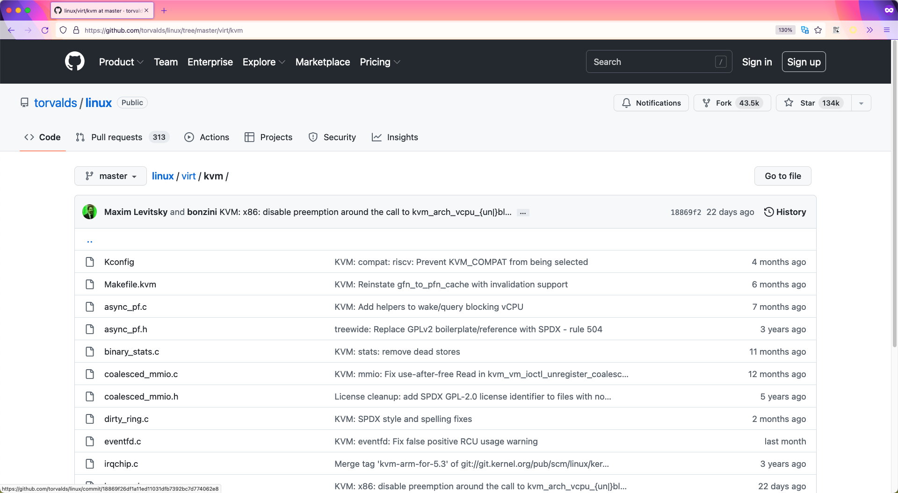

- KVM 项目由 Qumranet(现属于红帽) 于2006年10月启动。
- 从 RHEL 5.4 开始，在 x86-64 架构上运行的红帽企业 Linux 中完全支持 KVM
- KVM 设计性能十分优异，hypervisor 所需的许多功能都已通过 Linux 内核实施，如处理器调度、内存管理、物理设备驱动程序等

### QEMU-KVM 介绍

要启动虚拟机，仅仅加载 KVM 模块还不够。您需要 emulator 来模拟虚拟机的外围硬件设备。

QEMU 是一个开源机器仿真软件。这个模拟器将帮助您在一个架构上运行为另一种架构设计的的操作系统。例如，QEMU 可以在 x86 平台上运行为 ARM 平台设计的操作系统。然而，这里有一个问题。由于QEMU使用二进制转译（一种用于在主机上执行虚拟机指令的技术），因此**VM运行会比较缓慢**。

如果 QEMU 运行缓慢，那它如何能以接近物理机的速度运行基于 KVM 的虚拟机呢？KVM 开发人员考虑到了这个问题，并修改了 QEMU作为解决方案。这个修改后的 QEMU 被称为 QEMU-KVM，它可以直接与 KVM 模块交互，并在**不使用动态转译**的情况下，**直接在CPU上执行指令**。简而言之，我们使用 qemu-kvm 来运行基于 KVM 的虚拟机。      

Q：如果qemu-kvm可以运行虚拟机，那么为什么还需要libvirt

A：**libvirt管理qemu-kvm，qemu-kvm运行KVM虚拟机**，这点我们会在 [Setting up the environment](#setting-up-the-environment) 有更具体的介绍。

### QEMU-KVM 架构


KVM 开发者遵循了和 `Linux kernel` 开发者的一样的理念：**不要重新发明轮子**。也就是说，他们并没有尝试改变内核代码来创建一个hypervisor；相反，代码是围绕硬件供应商的虚拟化（VMX和SVM）的新硬件支持，用可加载的内核模块的形式开发的。

有一个通用的内核模块 kvm.ko 和其他硬件相关的**内核模块**，如 kvm-intel.ko（基于Intel CPU系统）或 kvm-amd.ko（基于AMD CPU系统）。相应的，KVM将载入 kvm-intel.ko（如果存在vmx标志）或 kvm-amd.ko（如果存在svm标志）模块。这将 Linux内核 变成了一个 hypervisor，从而实现了虚拟化。@季文康

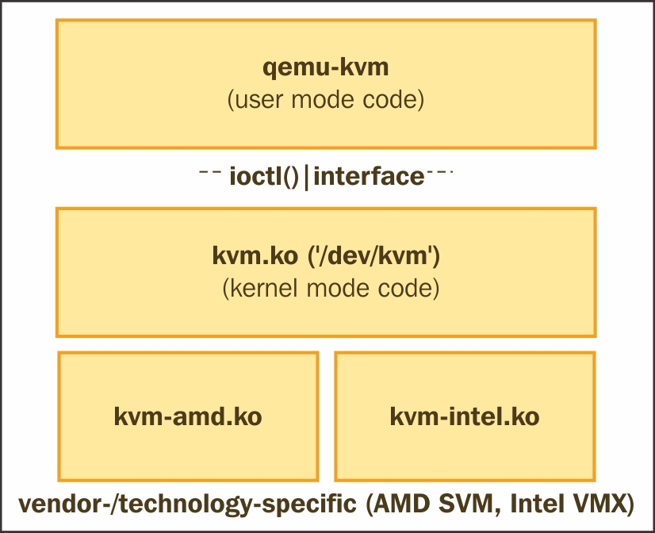

KVM暴露设备文件 /dev/kvm 供应用程序调用 ioctls()。QEMU 利用这个设备文件与 KVM通信，并创建、初始化和管理 VM 的内核模式上下文。KVM帮助实现用户空间在 QEMU-KVM 的用户模式地址空间内，提供 VM 的物理地址空间，其中包括 memory-mapped I/O。

#### 组件图


> （1）qemu-kvm 通过对 /dev/kvm 的 一系列 ICOTL 命令控制虚机；
>
> （2）一个 KVM 虚机即一个 Linux qemu-kvm 进程，与其他 Linux 进程一样被Linux 进程调度器调度；
>
> （3）KVM 虚机包括虚拟内存、虚拟CPU和虚机 I/O设备，其中，**内存和 CPU 的虚拟化由 KVM 内核模块负责实现，I/O 设备的虚拟化由 QEMU 负责实现；**
>
> （4）KVM虚机系统的内存是 qemu-kvm 进程的地址空间的一部分；
>
> （5）KVM 虚机的 vCPU 作为 线程运行在 qemu-kvm 进程的上下文中。

VMM 完成 Vcpu、内存的初始化后，通过 ioctl 调用KVM 接口，完成虚拟机的创建，并创建一个线程来运行 VM，由于VM在前期初始化的时候会设置各种寄存器来帮助KVM查找到需要加载的指令的入口（main函数）。所以线程在调用了KVM接口后，物理CPU的控制权就交给了VM。VM运行在VMX non-root模式，这是Intel-V或者AMD-V提供的一种特殊的CPU执行模式。然后当VM执行了特殊指令的时候，CPU将当前VM的上下文保存到VMCS寄存器（这个寄存器是一个指针，保存了实际的上下文地址），然后执行权切换到VMM。VMM 获取 VM 返回原因，并做处理。如果是IO请求，VMM 可以直接读取VM的内存并将IO操作模拟出来，然后再调用VMRESUME指令，VM继续执行，此时在VM看来，IO操作的指令被CPU执行了。@季文康

#### 框架图


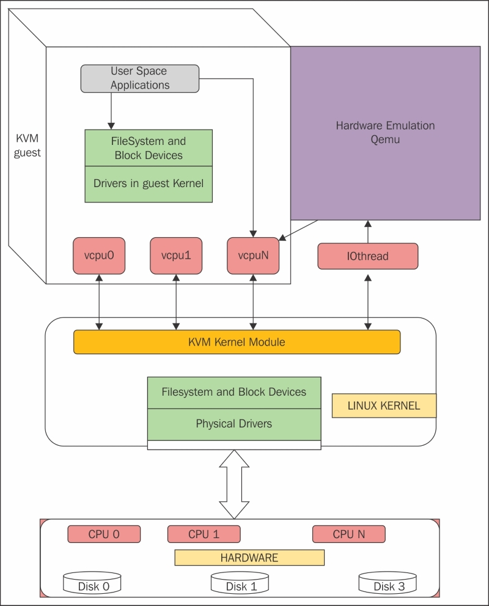

为了在物理 CPU 中执行 Guest 代码，QEMU 使用了 posix 线程。也就是说，Guest 虚拟CPU 在主机内核中作为 posix线程 执行。这本身就带来了许多好处，因为从上层来看它们只是主机内核的一些进程。从另一个角度看，KVM hypervisor 的用户空间部分由 QEMU 提供。QEMU 通过 KVM 内核模块运行客户代码。在使用 KVM 时，QEMU 也执行 I/O仿真、I/O设备设置、实时迁移等。

可见，KVM 客户机代码是受 VMM 控制直接运行在物理 CPU 上的。QEMU 只是通过 KVM 控制虚机的代码被 CPU 执行，但是它们本身并不执行其代码。**也就是说，CPU 并没有真正的被虚拟化成虚拟的 CPU 给客户机使用。**

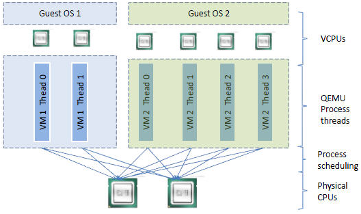

```shell
# 通过 qemu-kvm 创建一个 2 核心的虚机
[root@localhost ~]# qemu-kvm -cpu host -smp 2 -m 512m -drive file=/root/cirros-0.3.5-i386-disk.img -daemonize
VNC server running on `::1:5900'
# 查看 qemu-kvm 主进程
[root@localhost ~]# ps -ef | egrep qemu
root     24066     1 56 13:59 ?        00:00:10 qemu-kvm -cpu host -smp 2 -m 512m -drive file=/root/cirros-0.3.5-i386-disk.img -daemonize
root     24077 24041  0 13:59 pts/0    00:00:00 grep -E --color=auto qemu
# 查看 qemu-kvm 子线程
[root@localhost ~]# ps -Tp 24066
  PID  SPID TTY          TIME CMD
24066 24066 ?        00:00:00 qemu-kvm
24066 24067 ?        00:00:00 qemu-kvm
24066 24070 ?        00:00:07 qemu-kvm
24066 24071 ?        00:00:02 qemu-kvm
24066 24073 ?        00:00:00 qemu-kvm
# 通过 gdb 查看子线程的作用
(gdb) thread 1
[Switching to thread 1 (Thread 0x7fb830cb2ac0 (LWP 24066))]
#0  0x00007fb829eaebcd in poll () from /lib64/libc.so.6
(gdb) thread 2
[Switching to thread 2 (Thread 0x7fb7fddff700 (LWP 24073))]
#0  0x00007fb82de0e6d5 in pthread_cond_wait@@GLIBC_2.3.2 () from /lib64/libpthread.so.0
(gdb) thread 3
[Switching to thread 3 (Thread 0x7fb81fe6e700 (LWP 24071))]
#0  0x00007fb829eb02a7 in ioctl () from /lib64/libc.so.6
(gdb) thread 4
[Switching to thread 4 (Thread 0x7fb82066f700 (LWP 24070))]
#0  0x00007fb829eb02a7 in ioctl () from /lib64/libc.so.6
```

通过上面的数据得出：1 个 2 核心的虚拟机，4个子线程

- thread-1：主线程 loop 循环，循环操作 select 查看有无读写文件描述符，有的话进行读写操作；
- thread-2：子线程 异步 I/O 操作，主要针对磁盘映像操作（block drive）；
- thread-3：子线程 vcpu 线程，kvm_run 启动和运行虚拟机；
- thread-4：同 thread-3

### 总结时刻

QEMU 访问 KVM 模块创建的设备文件（/dev/kvm），并执行 ioctls() . 最后，KVM 利用 QEMU 成为一个完整的 hypervisor，而 KVM 是利用 CPU 提供的硬件虚拟化扩展(VMX或SVM，与CPU架构紧密耦合。**间接地，这表明VM也必须使用相同的架构以使用硬件虚拟化扩展/功能。**一旦启用KVM，它肯定会比其他技术(如二进制转译)提供更好的性能。

- 基于内核的虚拟机（KVM）代表了最新的开源虚拟化技术。这个项目的目标是创建一个现代化的 hypervisor，它建立在前几代技术的经验之上，并利用当今可用的现代硬件技术(VT-x，AMD-v)。

- KVM 需要芯片支持虚拟化技术（英特尔的 VT 扩展或者 AMD 的 AMD-V 扩展）
  - 对于是否支持也可以通过命令行查看：egrep '(vmx|svm)' --color=always /proc/cpuinfo
  - 在 bios 中是默认设置不打开该功能的，要去 bios 设置其为 enable
  - 如果有任何内容则说明当期硬件架构是支持 kvm 的，否则就不支持。 


## Libvirt

Q：为什么还要 `yum install libvirt ` 呢？

A：**操作系统装以后，天生就可以安装虚拟机了。**但是，内核支持虚拟化，不代表应用就能直接访问虚拟化。应用需要调用 lib 来使用虚拟化，这是免费的。**Libvirt将负责存储、网络和虚拟硬件需求，以启动虚拟机和VM生命周期管理。**

-----------

在系统管理实用程序 (如 virsh 和 virt-manager) 的请求下，libvirtd 为每个虚拟机启动了一个单独的 qemu-kvm **进程**。虚拟机的属性 (cpu数量、内存大小、I/O设备配置) 是在单独的 **XML 文件**中定义的，这些文件位于 /etc/libvirt/qemu目录中，libvirtd使用这些 XML 文件的详细信息来传递给 qemu-kvm 进程的参数列表。@季文康

进程：

```shell
qemu     14644  9.8  6.8 6138068 1078400 ?     Sl   03:14  97:29 /usr/bin/qemu-system-x86_64 -machine accel=kvm -name guest1 -S -machine pc--m 5000 -realtime mlock=off -smp 4,sockets=4,cores=1,threads=1 -uuid 7a615914-ea0d-7dab-e709-0533c00b921f -no-user-config -nodefaults -chardev socket,id=charmonitor-drive file=/dev/vms/hypervisor2,if=none,id=drive-virtio-disk0,format=raw,cache=none,aio=native -device id=net0,mac=52:54:00:5d:be:06
```

XML 文件：


### 通用层

- libvirt 是一组位于最终用户和 hypervisor 之间的API。

- 一个稳定的**通用层**来安全地管理主机上的虚拟机。
- 管理工具可以位于独立于主机的物理机上，并通过安全协议和主机进行交流。

- hypervisor 可以基于任何 libvirt 支持的虚拟化技术来构建

  - libvirt 支持下列 hypervisor：

    - The KVM/QEMU Linux hypervisor

    - The Xen hypervisor on Linux and Solaris hosts

    - The LXC Linux container system

    - The OpenVZ Linux container system

    - The User Mode Linux paravirtualized kernel

    - The VirtualBox hypervisor

    - The VMware ESX and GSX hypervisors

    - The VMware Workstation and Player hypervisors

    - The Microsoft Hyper-V hypervisor

    - The IBM PowerVM hypervisor

    - The Parallels hypervisor

    - The Bhyve hypervisor


----------

libvirt 是一个透明层，它接受用户的命令，根据底层虚拟化技术修改它们，然后在 hypervisor 上执行它们。这意味着，如果您知道如何使用基于 libvirt 的管理工具，您就能够管理前面提到的 hypervisor，**而不需要一一了解它们**。您可以选择任何虚拟化管理技术。他们都使用 libvirt 作为后端基础设施管理层，尽管前端工具看起来不同；例如，oVirt、RHEV（Red Hat企业虚拟化技术）、OpenStack、Eucalyptus等。而作为红帽，**我们会重点讲解 kvm/qemu 这部分。**

### 通用接口

尽管 **libvirt** 可同时访问多个主机，但 API 只限于**单节点操作**。libvirt 通过 hypervisor 提供的 API 来列举、监测和使用管理节点上的可用资源，其中包括 CPU、内存、储存、网络和非一致性内存访问（NUMA）分区。部署、创建、修改、监测、控制、迁移以及停止虚拟机操作都需要这些 API。

一个管理本地系统和连网主机的**通用接口**。很多人以为libvirt只能在单个节点或者运行libvirt的本地节点上运行，这并不正确。libvirt库支持远程功能。因此，任何libvirt工具（例如virt-manager）都可以通过传递一个额外的--connect参数，远程连接到网络上的libvirt守护进程。Fedora，CentOS等绝大多数发行版都安装了libvirt的客户端virsh（由libvirt -client package提供）。

### 组件图


### 架构图


<center>架构设计思想</center>

从该图可以看出，libvirt 的设计理念，是面向驱动的架构设计。对任何一种虚拟机技术都开发设计相对于该技术的驱动。在 libvirt api 之上会有很多个 driver，对于每一种虚拟机技术都会有一种 driver，用来充当该虚拟机技术与 libvirt 之间的包装接口。如此设计就可以避免 libvirt 需要设计各种针对不同虚拟机技术的接口，它主要关注底层的实现，提供对外接口调用，而不同的虚拟机技术通过调用 libvirt 提供的接口来完成自己所需要的功能。不同虚拟机技术就可以使用不同驱动，而且相互直接不会影响，方便扩展。而且 libvirt 提供了多种语言的编程接口，可以直接通过编程，调用 libvirt 提供的对外接口实现对虚拟机的操作。

### 总结时刻

简而言之，作为管理层，它负责提供执行管理任务的API，如虚拟机置备、创建、修改、监视、控制、迁移等。在Linux中，您会注意到一些进程成为了守护进程。libvirt进程也有一个守护进程，叫做libvirtd。与其他守护进程一样，libvirtd为其client发起的请求提供服务。

libvirt 根据客户端传递的连接URI，前一个（qemu://xxxx/system）请求以root身份连接到本地管理的QEMU和KVM域，或者VM的守护进程。后一个（qemu://xxxx/session）请求以普通用户身份连接到它自身的QEMU和KVM域。libvirtd 建立起与 hypervisor的连接。

客户端程序 virsh 或 virt-manager 就是通过这样的方式使 libvirtd 与 hypervisor 建立通信的。

## Setting up the environment

## 手动

### 1、创建镜像

```shell
在 KVM 中，创建一个虚拟机镜像，大小为 8G，其中 qcow2 格式为动态分配，raw 格式为固定大小。
# qemu-img create -f qcow2 ubuntutest.img 8G
```

### 2、创建虚拟机

```shell
创建虚拟机：名字叫 ubuntutest，内存大小为 1024M，使用动态分配的 8g 大小的磁盘，挂载 Ubuntu 的 ISO 光盘，VNC 端口为 5919
# /usr/libexec/qemu-kvm -enable-kvm -name ubuntutest  -m 2048 -hda ubuntutest.img -cdrom ubuntu-14.04-server-amd64.iso -boot d -vnc :19
```

### 3、启用虚拟机

```shell
# /usr/libexec/qemu-kvm -enable-kvm -name centos7 -m 2048 -hda /home/centos7 -vnc :19   -device virtio-net,netdev=network0 -netdev tap,id=network0,ifname=tap0,script=no,downscript=no,vhost=on
```

### 4、配置虚拟机网络

```shell
# ip link set tap0 up
# brctl addif br0 tap0
# ifconfig br0 192.168.57.1/24 # 虚拟机启动后，网卡没有配置，所以无法连接外网，先给 br0 设置一个 ip。
# sysctl -w net.ipv4.ip_forward=1
# sudo iptables -t nat -A POSTROUTING -o eth0 -j MASQUERADE # 在 Host 上设置 NAT，并且 enable ip forwarding
```


## 自动

### cockpit

```shell
yum install -y cockpit-machines cockpit
systemctl enable --now cockpit.service
```


### virt-manager


### virt-install

```shell
virt-install \
        --name centos7 \
        --import \
        --graphics vnc,listen=0.0.0.0 \
        --memory 4096 \
        --disk /home/centos7 \
        --os-variant rhel7.0
```

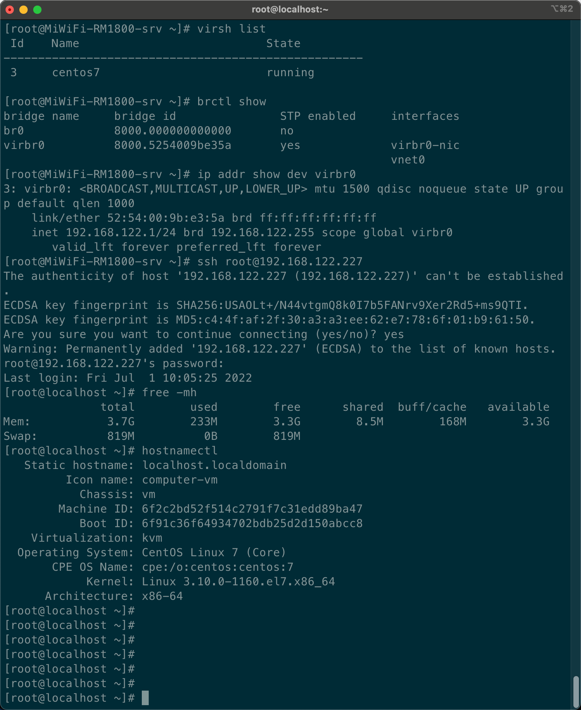

### virsh


# Reference

概览式了解：

[推荐：内部 docs 虚拟化分享](https://docs.google.com/presentation/d/1aqBbd_Qk5Yj7VzKeQ7xJlYwLSPHU9wc--93mXs28RpM/edit#slide=id.g4f15f900b1_0_305)

[书籍：《Mastering KVM Virtualization》](https://weread.qq.com/web/reader/707323107230073770737a2)

[书籍：《Mastering KVM Virtualization》](https://www.cnblogs.com/echo1937/category/1045922.html)

[博客园：KVM 相关总结](https://www.cnblogs.com/hukey/p/11138768.html)

名词性了解：

[wiki：保护环](https://en.wikipedia.org/wiki/Protection_ring)

[wiki：Hypervisor](https://en.wikipedia.org/wiki/Hypervisor)

半虚拟化：

[GitHub IO：virtio](https://rcore-os.github.io/rCore-Tutorial-Book-v3/chapter9/2device-driver-2.html)

[QEMU：virtio 设备](https://wiki.qemu.org/Features/VT-d#With_Virtio_Devices)

[博士论文：半虚拟化中入侵检测](https://www.researchgate.net/publication/221436288_Unobservable_Intrusion_Detection_based_on_Call_Traces_in_Paravirtualized_Systems)

虚拟化产品：

[知乎专栏：XEN](https://zhuanlan.zhihu.com/p/33324585)

[外文：kvm 与 xen 的不同](https://pediaa.com/what-is-the-difference-between-kvm-and-xen/)

------------------

[更多查看内部旧文参考](https://gitlab.cee.redhat.com/wji/learningmd/-/blob/master/qemu-kvm/libvirt%20and%20QEMU.md)

[更多相关文章参考](https://gitlab.cee.redhat.com/wji/learningmd/-/tree/master/qemu-kvm)

